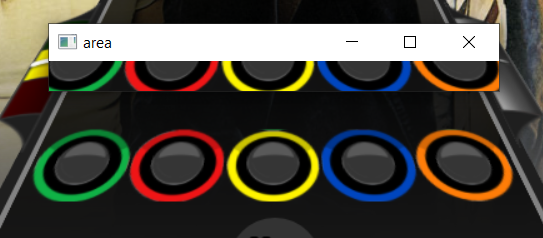
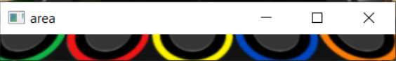
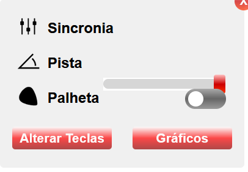

# GuitarFlash Auto Player (Work in Progress)

## Overview

The GuitarFlashAutoClicker is an algorithm design to automatically play the game _GuitarFlash_. It accomplishes this by:

* capturing the game screen in real-time.

* detecting appearing notes in predifined areas

* simulating keypresses based on detected notes 

This project is still a work in progress, and improvements may be needed for accuracy, efficency and robustness.

## Game Setup and Environment

**1. Game Website**

* The game can be played at: <a href="https://guitarflash3.com/" target="_blank">Guitar Flash 3 Official Website</a>

**2. Recommended Main Area Setup**

* For optimal performance, the main_area should be adjusted based on screen resolution and game window positioning.
    The current values being used for a 1080x1920 monitor are:

    * top: 920

    * left: 500

    * width: 450

    * height: 30

These values should be calibrated to match your specific game layout to ensure accurate note detection.

**Example of Main Area Setup:**

* Below is an example screenshot of how the detection area should be positioned for best results:

    

* This is a better view of how the area should be setup for better results:

    

**3. In Game Track setup**
* The track height should be set to max for better note detection:

    

## Implementation Details

**1. Class:** GuitarFlashAutoClicker

This class is responsible for encapsulating the entire logic for detecting notes and playing the game.

**Attributes:**
* **keys:** A dictionary mapping note colors to corresponding keyboard keys.

* **areas:** Specifies screen region where the notes area expected to appear.

* **main_area:** Defines the game's main detection region for capturing frames.

* **screenshot_lock:** A threading lock to prevent race conditions while capturing screenshots.

* **screenshot:** Stores the latest captured frame

**Methods:**
**2. capture_screen(self)**
* Continually captures the game screen using mss lib.

* Stores the screenshot in self.screenshot.

* Displays the captured area for debugging.

* Listens for the 'q' key to stop displaying the preview.

**3. detect_notes(self, color, area)** 
* Extracts the region of interest (ROI) for the specified note color.

* Converts the ROI to grayscale and computes the mean pixel intesity.

* If the intensity exceeds a threshold of 65, simulates respective keypress.

* Runs in an infinite loop with a small delay(frametime).

**4. start_game(self)**
* Starts the capture_screen method in separate thread.

* Spawns a thread for each note color, calling detect_notes().

* Keeps the program running indefinitely.

## Performance Considerations 

**1. Accuracy of Note Detection**
* The threshold for detecting note is set to 65, which may need further fine-tuning for better detection.

* Variability in game lighting or background changes affect note detection.

**2. Threading and Performance**
* The algorithm relies on multiple threads:

    * One for screen capture.

    * One for each note detection.

* High frame rates (120 FPS) may cause performance issues depending on system resources.

* A more efficient approach could be to batch-process multiple notes in a single thread.

**3. Potential Improvements**
* **Optimization of Note Detection:** Implementing edge detection or template matching instead of mean intesity.

* **Threading Efficiency:** Using asynchronous programming (asyncio) instead of multiple threads.

* **Dynamic Calibration:** Adjusting note detection threshold dynamically based on gameplay.

## Know Issues
* Note Detection: When notes cluster together, the algorithm struggles to identify and press them quickly enough, leading to missed notes or delayed keypresses.

* Lighting Effect: During special lighting effects (like lightning), all notes are detected as being pressed simultaneously, causing the algorithm to press all the keys at once.

* Holding notes: Currently, the algorithm cannot properly handle long notes that require a sustained keypress.

## Current Status
* The algorithm is functional but still a work in progress.

* Future improvements should focus on performance optimization and increasing detection accuracy.

## Next Steps

* Improve note detection reliability.

* Optimize threading to reduce CPU usage.

* Implement logging for debugging and performance analysis.

## Example Usage

if __name__ == "__main__":
    guitar_flash = RefactorGuitarFlask()
    guitar_flash.start_game()

This script initializes and runs the auto player.

## Conclusion

This algorithm provides an automated way to play _Guitar Flash 3_ but still requires improvements and further developing in note detection, performance, long notes handling and utilizing the special feature in game. Future works should focus on refining these issues and optimizing the overall system usage resource.

## Disclaimer

This algorithm is not intended to be used for exploiting the game engine in any way. As the creator of this auto player, I do not condone its use for any self-benefit, unfair advantage, or malicious purposes of any kind.